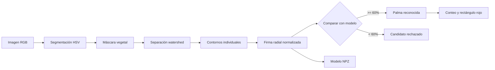
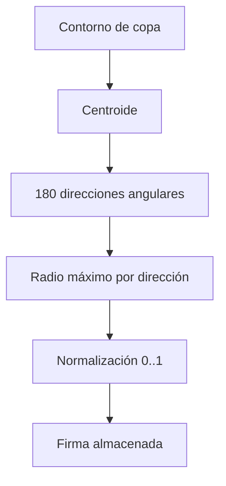
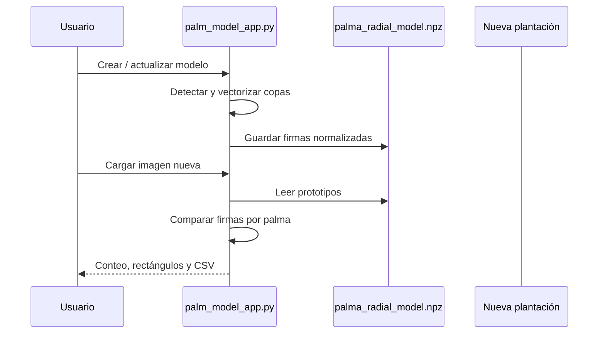

# Radial Signature

[](https://github.com/asoto59g/CropCount)
[](https://github.com/asoto59g/CropCount/stargazers)
[](https://github.com/asoto59g/CropCount/commits/main/)
[](https://www.gnu.org/licenses/gpl-3.0.html)
[](https://cropcount-cftuhniyxaof8yjx9u7ujk.streamlit.app/)
[](https://www.python.org/)
[](https://streamlit.io/)
[](https://opencv.org/)
[](https://numpy.org/)
[](#estado-y-validacion)


Aplicación pública: <https://cropcount-cftuhniyxaof8yjx9u7ujk.streamlit.app/>

Aplicación experimental para detectar cultivos en imágenes RGB, vectorizar plantas, extraer firmas radiales y contar individuos en nuevas plantaciones. El flujo está diseñado para imágenes aéreas con una resolución conocida, actualmente calibrada por defecto a **6 cm/píxel**.

La interfaz general se llama **CropCount**. Está preparada para trabajar por perfiles de cultivo, por ejemplo **Oil palm**, **Banana**, **Pineapple**, **Aloe vera** y un perfil **Custom crop** para extender el sistema a otras especies.

## Motor de detección actual

CropCount usa actualmente un método geométrico y no una red neuronal:

```text
Imagen RGB -> segmentación HSV -> máscara vegetal -> watershed
		   -> contornos individuales -> firma radial -> comparación
```

El archivo del modelo identifica el método como `radial_signature_hsv_watershed`. Esto permite diferenciarlo claramente de modelos basados en YOLO u otras redes de reconocimiento.

| Enfoque | Qué aprende o calcula | Necesita cajas etiquetadas | Ventaja principal | Uso recomendado |
|---|---|---:|---|---|
| **CropCount actual** | Color, separación watershed y forma radial | No | Rápido de ajustar y explicable | Imágenes con buen contraste y resolución conocida |
| **YOLO detector** | Apariencia de cada planta mediante red neuronal | Sí | Mejor tolerancia a fondo, sombras y variación visual | Producción con muchas imágenes etiquetadas |
| **Clasificación de imagen** | Clase de una imagen o recorte completo | Sí | Decide qué contiene una imagen | No basta para contar individuos por sí sola |
| **Segmentación semántica** | Clase de cada píxel | Sí | Separa vegetación compleja | Cuando el borde de cada planta es importante |

### Qué significa para el proyecto

- **Ahora:** CropCount cuenta usando firmas radiales almacenadas en archivos `.npz`.
- **No ahora:** no descarga pesos YOLO, no entrena una red y no afirma tener reconocimiento profundo.
- **Siguiente evolución posible:** entrenar un detector YOLO por cultivo con cajas de plantas y usar sus detecciones como entrada para las firmas radiales.
- **Alternativa híbrida:** YOLO localiza cada planta y CropCount valida su forma mediante firma radial.

Para usar YOLO de forma responsable habría que preparar imágenes anotadas por cultivo, dividirlas en entrenamiento/validación/prueba y medir precisión, recall, mAP y error de conteo. No conviene mezclar un modelo YOLO de banano con perfiles de piña, sábila o palma.

> **Importante:** el sistema actual es un prototipo de visión por color y geometría. La certeza es un índice de similitud, no una probabilidad estadística ni una precisión validada en campo.

## Flujo general



### Qué representa una firma radial

Para cada copa se calcula un centroide y se mide el radio máximo en ángulos consecutivos. La firma se normaliza entre 0 y 1 para que la comparación no dependa directamente del tamaño absoluto de la imagen.



## Requisitos

- Windows, macOS o Linux.
- Python 3.10 o superior.
- Imagen aérea con resolución de terreno conocida.
- Para el caso de referencia: aproximadamente `6 cm/píxel`.

## Instalación

Desde la carpeta del proyecto:

```powershell
python -m pip install -r requirements.txt
```

El archivo `requirements.txt` instala Streamlit, OpenCV, NumPy, Pillow y Matplotlib.

## Publicar en Streamlit Community Cloud

El repositorio está preparado para desplegar **CropCount** desde:

<https://share.streamlit.io>

En Streamlit Cloud seleccionar:

| Campo | Valor |
|---|---|
| Repository | `asoto59g/CropCount` |
| Branch | `main` |
| Main file path | `app.py` |
| Python dependencies | `requirements.txt` |

Después de desplegar, la aplicación quedará disponible en una URL pública de Streamlit. `app.py` es la entrada principal y muestra la navegación multipágina: **Radial Signature**, **Model Generation** y **CropCount**. El modelo y las imágenes que estén dentro del repositorio se cargarán como archivos locales de la app. Los datos privados o pesados deben mantenerse fuera del repositorio y cargarse mediante los controles de la interfaz o un almacenamiento autorizado.

## Aplicaciones

### 0. CropCount: aplicación general para cultivos

Archivo: [`cropcount_app.py`](cropcount_app.py)

```powershell
python -m streamlit run cropcount_app.py --server.port 8504
```

URL: <http://localhost:8504>

CropCount es la aplicación recomendada para ampliar el sistema a diferentes cultivos. El usuario selecciona un perfil, construye un modelo con imágenes representativas y después cuenta plantas individuales en nuevas imágenes.

Perfiles incluidos:

| Perfil | Diámetro inicial | Modelo |
|---|---:|---|
| `Oil palm` | `4.0 m` | `cropcount_oil_palm.npz` |
| `Banana` | `2.0 m` | `cropcount_banana.npz` |
| `Pineapple` | `1.0 m` | `cropcount_pineapple.npz` |
| `Aloe vera` | `0.5 m` | `cropcount_aloe_vera.npz` |
| `Custom crop` | `1.0 m` | `cropcount_custom.npz` |

Flujo de uso:

1. Seleccionar el tipo de cultivo.
2. Ajustar resolución, diámetro mínimo y segmentación HSV.
3. Cargar una imagen individual de referencia y una plantación de entrenamiento.
4. Pulsar **Build / update crop model**.
5. Cargar el modelo y una nueva plantación.
6. Pulsar **Count plants in new image**.
7. Revisar los rectángulos rojos y descargar el conteo CSV.

Cada especie mantiene su propio archivo `.npz`; no se deben mezclar firmas de banano, piña, sábila y palma en el mismo modelo.

Para añadir otro cultivo, editar `PROFILES` en `cropcount_app.py`:

```python
"Coffee": {"slug": "coffee", "diameter_m": 1.5},
```

Después se deben recopilar imágenes representativas de ese cultivo y crear un modelo independiente. El perfil solo define valores iniciales; la calidad depende de la resolución, iluminación, segmentación y diversidad de las imágenes.

### 1. Radial Signature: vectorizar una imagen individual

Página: [`radial_signature_page.py`](radial_signature_page.py), lanzada desde `app.py`

```powershell
python -m streamlit run app.py --server.port 8501
```

URL: <http://localhost:8501>

Funciones:

- Carga automática de `palma africana.png`.
- Segmentación por rango HSV.
- Máscara vegetal y contorno vectorial.
- Simplificación Douglas-Peucker entre `0%` y `1%` de la diagonal.
- Firma radial de la silueta.
- Exportación de contorno SVG y firma CSV.

### 2. Model Generation: comparar una plantación contra una referencia

Página: `pages/2_Model_Generation.py`, basada en [`compare_app.py`](compare_app.py)

```powershell
python -m streamlit run compare_app.py --server.port 8502
```

URL: <http://localhost:8502>

Valores iniciales:

| Parámetro | Valor |
|---|---:|
| Resolución de terreno | `6 cm/píxel` |
| Diámetro mínimo de copa | `4 m` |
| Certeza mínima | `60%` |
| Muestras de firma | `180` |

La aplicación usa `palma africana.png` como referencia y `DJI_11.jpg` como plantación de ejemplo. Las copas conectadas se separan con watershed. Cada candidato se compara con la firma de referencia considerando rotaciones circulares.

Resultados visuales:

- Naranja: candidato vectorizado.
- Rojo: palma que supera el umbral configurado.
- Tabla: certeza, correlación, error y estado por palma.
- CSV: descarga de resultados individuales.

### 3. CropCount: crear y reutilizar modelos de firmas

Página: `pages/3_CropCount.py`, basada en [`cropcount_app.py`](cropcount_app.py)

```powershell
python -m streamlit run palm_model_app.py --server.port 8503
```

URL: <http://localhost:8503>

#### Crear el modelo

1. Mantener `6.0 cm/píxel`, salvo que la imagen tenga otra calibración.
2. Mantener inicialmente `4.0 m` de diámetro mínimo de copa.
3. Pulsar **Crear / actualizar modelo**.
4. Se guarda `palma_radial_model.npz`.

El modelo incluye la firma individual de `palma africana.png` y las firmas de las palmas detectadas en `DJI_11.jpg`. En la ejecución de referencia se guardaron `342` firmas.

#### Contar una plantación nueva

1. Cargar una imagen en **Nueva plantación para contar**.
2. Cargar `palma_radial_model.npz` en **Modelo NPZ existente**, si no está en la carpeta del proyecto.
3. Ajustar HSV y resolución si la captura es diferente.
4. Pulsar **Detectar en nueva plantación**.
5. Revisar los rectángulos rojos y descargar `conteo_palmas.csv`.



## Archivos del proyecto

| Archivo | Propósito |
|---|---|
| [`app.py`](app.py) | Vectorización y firma de una imagen individual. |
| [`compare_app.py`](compare_app.py) | Comparación de una plantación contra una referencia. |
| [`palm_model_app.py`](palm_model_app.py) | Creación y aplicación del modelo reutilizable. |
| [`cropcount_app.py`](cropcount_app.py) | Aplicación general para múltiples tipos de cultivo. |
| `palma africana.png` | Imagen de referencia individual. |
| `DJI_11.jpg` | Plantación aérea de prueba, `4056 x 3040` píxeles. |
| `palma_radial_model.npz` | Banco comprimido de firmas y metadatos. |
| `requirements.txt` | Dependencias Python. |
| `conteo_palmas.csv` | Resultado generado al detectar una plantación. |
| `Train_photos/` | Imágenes disponibles para ampliar el conjunto de entrenamiento. |

## Formato del modelo NPZ

`palma_radial_model.npz` es un archivo NumPy comprimido con:

| Campo | Contenido |
|---|---|
| `signatures` | Matriz de firmas normalizadas, una fila por palma. |
| `method` | Identificador del motor, por ejemplo `radial_signature_hsv_watershed` en CropCount. |
| `crop` | Perfil de cultivo asociado al modelo CropCount. |
| `resolution_cm` | Resolución usada en centímetros por píxel. |
| `minimum_diameter_m` | Filtro mínimo de diámetro de copa. |
| `hsv_settings` | Tono, saturación, valor y cierre morfológico. |
| `samples` | Número de muestras angulares, actualmente `180`. |
| `created_at` | Fecha UTC de creación del modelo. |

## Interpretación de la certeza

La similitud combina dos componentes:

```text
similitud = 0.60 * correlación + 0.40 * (1 - error medio)
```

La comparación prueba distintas rotaciones de la firma para reducir la dependencia de la orientación de la palma. El umbral inicial es `60%`, pero debe calibrarse usando imágenes nuevas etiquetadas manualmente.

### Recomendación de validación

No evaluar el modelo únicamente con `DJI_11.jpg` después de haber incorporado sus palmas al modelo: eso mide reidentificación del conjunto de entrenamiento y puede inflar el resultado. Para validar el conteo:

1. Separar varias imágenes de plantaciones no usadas para crear el modelo.
2. Contar manualmente las palmas en una muestra.
3. Ejecutar el modelo con `60%`, `70%`, `80%` y otros umbrales.
4. Comparar falsos positivos, falsos negativos y error absoluto de conteo.
5. Elegir el umbral final según el costo operativo de cada error.

## Estado y validación

Validación realizada durante el desarrollo:

- `app.py`, `compare_app.py`, `palm_model_app.py` y `cropcount_app.py` compilan sin errores de sintaxis.
- `DJI_11.jpg` se procesa a `6 cm/píxel`.
- La detección de referencia separó cientos de candidatos de copa.
- El modelo de prueba se guardó con `342 firmas`.
- La app de modelo generó conteo, rectángulos rojos y CSV sin errores.
- CropCount carga correctamente el perfil de cultivo y sus acciones de creación y conteo.

Limitaciones conocidas:

- La segmentación depende de color HSV y puede fallar con sombras, suelo, reflejos o vegetación diferente.
- Watershed puede dividir una copa grande en varios candidatos o unir palmas muy próximas.
- El diámetro mínimo debe ajustarse si cambia la edad de la plantación o la resolución.
- El modelo actual no sustituye una validación geoespacial o agronómica.
- Banano, piña, sábila y otros cultivos requieren modelos propios creados con imágenes representativas y validadas.

## Licencia y datos

El código fuente de CropCount se distribuye bajo **GNU General Public License v3.0 (GPLv3)**. Consulta [`LICENSE`](LICENSE) y el texto oficial en <https://www.gnu.org/licenses/gpl-3.0.html>.

La GPLv3 aplica al código fuente, no concede automáticamente derechos sobre:

- `DJI_11.jpg` y otras imágenes aéreas.
- Fotografías de `Train_photos/`.
- Datos geoespaciales, ortomosaicos o información de clientes.
- Modelos `.npz` derivados de datos cuyo uso esté restringido.

Antes de redistribuir imágenes, modelos o resultados, verificar la autorización del propietario de los datos. Si se requiere que los datos tengan una licencia distinta, documentarla por separado.
