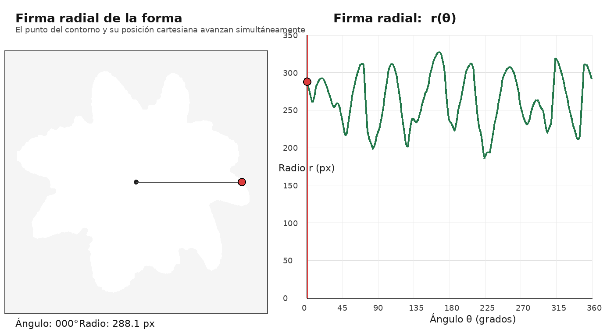
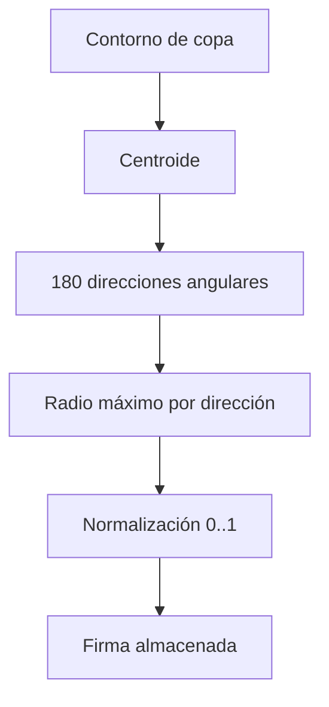
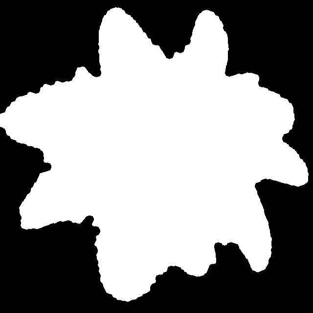
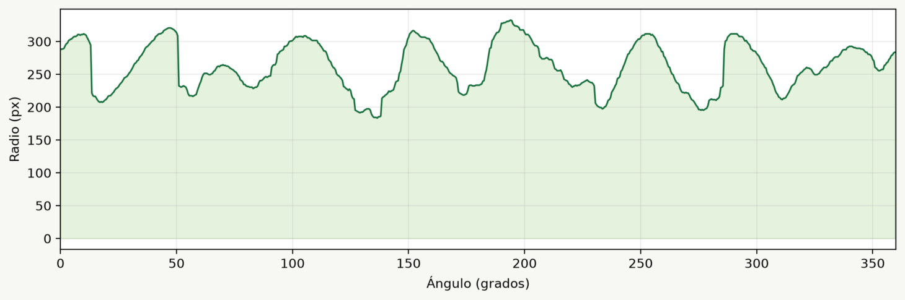

# Radial Signature / CropCount

<p align="center">
  
</p>

[](https://github.com/asoto59g/CropCount)
[](https://github.com/asoto59g/CropCount/stargazers)
[](https://github.com/asoto59g/CropCount/commits/main/)
[](https://www.gnu.org/licenses/gpl-3.0.html)
[](https://cropcount-cftuhniyxaof8yjx9u7ujk.streamlit.app/)
[](https://www.python.org/)
[](https://streamlit.io/)
[](https://opencv.org/)
[](https://numpy.org/)
[](#7-limitaciones-tecnicas)

Aplicación pública: <https://cropcount-cftuhniyxaof8yjx9u7ujk.streamlit.app/>

## 1. Problema que resuelve

Contar plantas individuales en imágenes aéreas RGB suele ser lento y subjetivo. CropCount ayuda a detectar cultivos, vectorizar copas, extraer firmas radiales y contar individuos en nuevas plantaciones cuando se conoce la resolución de terreno (caso de referencia: **6 cm/píxel**).

La interfaz general se llama **CropCount**. Está preparada para perfiles como **Oil palm**, **Banana**, **Pineapple**, **Aloe vera** y **Custom crop**.

## 2. Innovación o aporte técnico

CropCount usa un método **geométrico y explicable**, no una red neuronal:

```text
Imagen RGB -> segmentación HSV -> máscara vegetal -> watershed
           -> contornos individuales -> firma radial -> comparación
```

El modelo se identifica como `radial_signature_hsv_watershed`, para distinguirlo claramente de YOLO u otros detectores profundos.

| Enfoque | Qué aprende o calcula | Necesita cajas etiquetadas | Ventaja principal | Uso recomendado |
|---|---|---:|---|---|
| **CropCount actual** | Color, separación watershed y forma radial | No | Rápido de ajustar y explicable | Imágenes con buen contraste y resolución conocida |
| **YOLO detector** | Apariencia de cada planta mediante red neuronal | Sí | Mejor tolerancia a fondo, sombras y variación visual | Producción con muchas imágenes etiquetadas |
| **Clasificación de imagen** | Clase de una imagen o recorte completo | Sí | Decide qué contiene una imagen | No basta para contar individuos por sí sola |
| **Segmentación semántica** | Clase de cada píxel | Sí | Separa vegetación compleja | Cuando el borde de cada planta es importante |

- **Ahora:** cuenta con firmas radiales en archivos `.npz`.
- **No ahora:** no descarga pesos YOLO ni afirma reconocimiento profundo.
- **Evolución posible:** YOLO localiza plantas y CropCount valida la forma con firma radial.

> **Importante:** la certeza es un índice de similitud, no una probabilidad estadística ni una precisión validada en campo.

## 3. Metodología y algoritmo


Para cada copa se calcula un centroide y el radio máximo en 180 direcciones angulares. La firma se normaliza entre 0 y 1:



### Interpretación de la certeza

```text
similitud = 0.60 * correlación + 0.40 * (1 - error medio)
```

Se prueban rotaciones circulares de la firma. El umbral inicial es `60%` y debe calibrarse con imágenes nuevas etiquetadas manualmente.

## 4. Datos de entrada y formatos soportados

| Entrada | Formatos | Notas |
|---|---|---|
| Imagen de planta o plantación | `.png`, `.jpg`, `.jpeg`, `.tif`, `.tiff` | RGB. La resolución de terreno debe conocerse. |
| Modelo de firmas | `.npz` | NumPy comprimido con firmas y metadatos. |
| Salidas | `.csv`, `.jpg` anotada, `.svg`, `.npz` | Se generan desde la interfaz; no forman parte del repositorio. |

### Archivos de ejemplo incluidos en el repositorio

| Archivo | Propósito |
|---|---|
| `palma africana.png` | Referencia individual de palma. |
| `DJI_11.jpg` | Plantación aérea de prueba (`4056 x 3040`). |
| `palma_radial_model.npz` | Banco de firmas de referencia (~342 firmas). |
| `firma_radial_animada.gif` | Animación de la firma radial. |
| `animacion/perim.jpg` | Máscara/perímetro de ejemplo. |
| `animacion/graph.png` | Firma radial de ejemplo (ángulo vs radio). |
| `examples_for_count/*.jpg` | Imágenes DJI adicionales para probar el conteo. |

Los modelos por perfil (`cropcount_oil_palm.npz`, etc.) se crean en local al usar CropCount; no se publican vacíos en el repo.

### Formato del modelo NPZ

| Campo | Contenido |
|---|---|
| `signatures` | Matriz de firmas normalizadas, una fila por planta. |
| `method` | Por ejemplo `radial_signature_hsv_watershed`. |
| `crop` | Perfil de cultivo (CropCount). |
| `resolution_cm` | Centímetros por píxel. |
| `minimum_diameter_m` | Diámetro mínimo de copa. |
| `hsv_settings` | Tono, saturación, valor y cierre morfológico. |
| `samples` | Muestras angulares (`180`). |
| `created_at` | Fecha UTC de creación. |

## 5. Instalación y ejecución

### Requisitos

- Windows, macOS o Linux.
- Python 3.10 o superior.

### Instalación limpia

```powershell
python -m venv .venv
.\.venv\Scripts\Activate.ps1
python -m pip install --upgrade pip
python -m pip install -r requirements.txt
```

En macOS/Linux:

```bash
python3 -m venv .venv
source .venv/bin/activate
python -m pip install --upgrade pip
python -m pip install -r requirements.txt
```

`requirements.txt` instala Streamlit, OpenCV headless, NumPy, Pillow, Matplotlib y `streamlit-image-coordinates`.

### Ejecutar la app multipágina

```powershell
python -m streamlit run app.py
```

URL local: <http://localhost:8501>

`app.py` abre la navegación: **Radial Signature**, **Model Generation** y **CropCount**.

### Entradas alternativas por script

| Comando | Puerto |
|---|---|
| `python -m streamlit run app.py --server.port 8501` | Radial Signature + multipágina |
| `python -m streamlit run compare_app.py --server.port 8502` | Model Generation |
| `python -m streamlit run palm_model_app.py --server.port 8503` | Modelo de palma |
| `python -m streamlit run cropcount_app.py --server.port 8504` | CropCount multi-cultivo |

### Ejemplo reproducible (palma)

1. Clonar el repo e instalar dependencias.
2. Ejecutar `python -m streamlit run app.py`.
3. En **Radial Signature**, usar la carga automática de `palma africana.png` y exportar firma/SVG.
4. En **Model Generation**, comparar contra `DJI_11.jpg` con `6 cm/píxel`, diámetro `4 m` y certeza `60%`.
5. En **CropCount** (o `palm_model_app.py`), cargar `palma_radial_model.npz` y contar sobre una imagen nueva o sobre `DJI_11.jpg`.

### Tamaño de imágenes cargadas

Por defecto Streamlit permite hasta **200 MB** por carga. En local se puede subir el límite:

```powershell
python -m streamlit run app.py --server.maxUploadSize 1024
```

O en `.streamlit/config.toml`:

```toml
[server]
maxUploadSize = 1024
```

En Streamlit Community Cloud aplican los límites del servicio. Para ortomosaicos grandes conviene comprimir, bajar resolución o dividir en teselas.

### Publicar en Streamlit Community Cloud

| Campo | Valor |
|---|---|
| Repository | `asoto59g/CropCount` |
| Branch | `main` |
| Main file path | `app.py` |
| Python dependencies | `requirements.txt` |

Despliegue desde <https://share.streamlit.io>. Datos privados o pesados deben quedarse fuera del repositorio.

## 6. Ejemplo visual

Animación de la firma radial:

<p align="center">
  
</p>

Máscara/perímetro de una copa segmentada:



Firma radial (radio por ángulo):



En la app, las palmas candidatas se dibujan en naranja y las reconocidas sobre el umbral en rojo; el conteo se descarga como CSV. Para probar con imágenes nuevas, usar `examples_for_count/` (`DJI_18.jpg`, `DJI_23.jpg`, `DJI_26.jpg`, `DJI_28.jpg`).

### Flujo CropCount (revisión de falsos positivos)

1. Seleccionar perfil de cultivo.
2. Ajustar resolución, diámetro y HSV.
3. Cargar referencia + plantación de entrenamiento.
4. **Build detections for review** → excluir falsos positivos en la vista completa.
5. **Save reviewed crop model**.
6. Cargar modelo + nueva plantación → **Count plants in new image**.
7. Descargar CSV e imagen anotada.

Cada especie debe tener su propio `.npz`. Para añadir un cultivo, editar `PROFILES` en `cropcount_app.py`:

```python
"Coffee": {"slug": "coffee", "diameter_m": 1.5},
```

## 7. Limitaciones técnicas

- La segmentación HSV falla con sombras fuertes, suelo húmedo, reflejos o vegetación de color similar.
- Watershed puede partir una copa o fusionar plantas muy próximas.
- El diámetro mínimo depende de la edad del cultivo y de la resolución.
- No sustituye validación geoespacial ni agronómica en campo.
- Banano, piña, sábila y otros cultivos requieren modelos propios con imágenes representativas.
- No evaluar solo con `DJI_11.jpg` si esa misma imagen entró al modelo: eso infla el resultado por reidentificación.

### Validación realizada en desarrollo

- Compilación sintáctica de `app.py`, `compare_app.py`, `palm_model_app.py` y `cropcount_app.py`.
- Instalación limpia verificada: `python -m venv` + `pip install -r requirements.txt` + `streamlit run app.py` → HTTP 200 (Python 3.14).
- Procesamiento de `DJI_11.jpg` a `6 cm/píxel` con cientos de candidatos.
- Modelo de referencia con ~`342` firmas y exportación de conteo/CSV.
- App pública en Streamlit Community Cloud.

## 8. Roadmap

- [ ] Empaquetar un dataset de demostración con licencia explícita por imagen.
- [ ] Métricas de conteo (FP/FN, error absoluto) sobre un set de hold-out.
- [ ] Perfiles calibrados por cultivo más allá de palma.
- [ ] Exportación geoespacial opcional (centroides a GeoJSON/SHP) cuando exista CRS.
- [ ] Prototipo híbrido YOLO (localización) + firma radial (validación de forma).
- [ ] Pruebas automatizadas de install limpia y smoke de Streamlit en CI.

## 9. Licencia y citación sugerida

El código fuente se distribuye bajo **GNU General Public License v3.0 (GPLv3)**. Consulta [`LICENSE`](LICENSE) y <https://www.gnu.org/licenses/gpl-3.0.html>.

La GPLv3 aplica al código, no concede automáticamente derechos sobre:

- `DJI_11.jpg`, `palma africana.png` y demás imágenes de ejemplo.
- Datos geoespaciales, ortomosaicos o información de clientes.
- Modelos `.npz` derivados de datos con uso restringido.

Antes de redistribuir imágenes, modelos o resultados, verificar la autorización del propietario de los datos.

### Citación sugerida

```text
Soto Barquero, A. (2026). CropCount / Radial Signature: conteo de cultivos por
firmas radiales (HSV + watershed) [Software].
https://github.com/asoto59g/CropCount
```

### Archivos del código

| Archivo | Propósito |
|---|---|
| [`app.py`](app.py) | Entrada multipágina Streamlit. |
| [`radial_signature_page.py`](radial_signature_page.py) | Vectorización y firma de una imagen. |
| [`compare_app.py`](compare_app.py) | Comparación plantación vs referencia. |
| [`palm_model_app.py`](palm_model_app.py) | Modelo reutilizable de palma. |
| [`cropcount_app.py`](cropcount_app.py) | App multi-cultivo con revisión de FP. |
| [`requirements.txt`](requirements.txt) | Dependencias Python. |
| [`LICENSE`](LICENSE) | GPLv3. |
